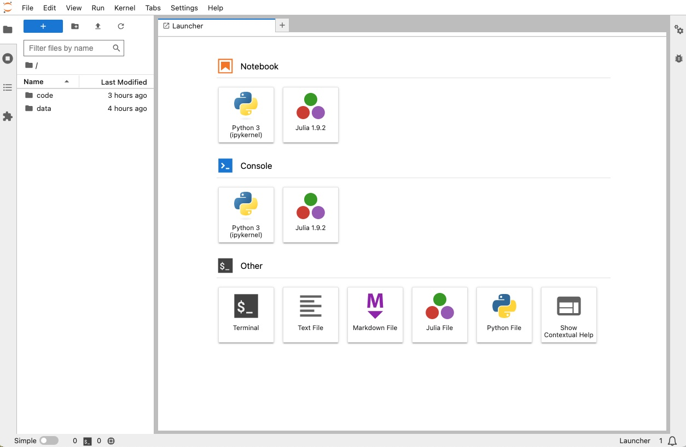

# SeisMonitoring Example

A minimal working example with a Jupyter notebook of the seismic noise processing using [SeisMonitoring.jl](https://github.com/kura-okubo/SeisMonitoring.jl).


View the notebook, click the badge:

<a href="https://nbviewer.org/github/kura-okubo/SeisMonitoring_Example/blob/main/code/run_seismonitoring.ipynb" target="_blank">
   
</a>
<br><br>

or read the QR code:


## How to run the notebook

We have two options to run this notebook.

### 1. Run using the docker container
We first recommend using the docker container, which does not contaminate your environment in the local machine.

To run this notebook using docker,

1. **Install the docker engine on your machine.**

    <a href="https://docs.docker.com/engine/install" target="_blank">See the official documentation for the installation.</a> The Docker Desktop is useful in general machines like Windows, Linux, and Mac OS. We developed this notebook using MacOS with both M1 (Monterey 12.6.7) and Intel (Ventura 13.4.1) chips. We have also tested this notebook with Windows 10 using Docker Desktop. You need to set up the [WSL2](https://docs.docker.com/desktop/wsl/) to run the docker engine.

   You can configure them in the `settings` of the Docker Desktop. The required docker resources are the following:

   | Resources    | Allocation |
   | --- | --- |
   | CPUs | >=2 |
   | Memory | > 8GB |
   | Swap | > 1GB |
   | Disk image size | > 8GB |


3. **Launch the docker engine.**

   Type `docker ps` in the terminal to check if the docker command works.
   if you get the error like `Cannot connect to the Docker daemon at unix:///var/run/docker.sock. Is the docker daemon running?`,
   the docker engine is not likely to be ready. Check the status of Docker desktop.

4. **Download the example repository, and build the docker container.**

   Type the commands below to build the docker container in your machine.

    ```bash
    git clone https://github.com/kura-okubo/SeisMonitoring_Example
    cd SeisMonitoring_Example
    docker compose up -d
    ```

   **NOTE:** For Windows users, `git clone` may fail as some of the file name contains a colon. Type `cd SeisMonitoring_Example; git restore --source=HEAD :/` to restore the docker files.
    
   The JupyterLab server automatically starts in the container when you start it following the description written in `docker-compose.yml`. Type
   ```
   docker compose ps
   ```
   and if the container is successfully started, it returns as follows:
   ```
   NAME                SERVICE             STATUS              PORTS
   seismonitoring      seismonitoring      running             0.0.0.0:8888->8888/tcp
   ```

   We use the docker image of **Julia v1.9.2**, which is the latest version as of August 2023.

6. **Launch the JupyterLab in your web browser.**

    Go to <a href="http://localhost:8888" target="_blank">http://localhost:8888</a> with your browser (e.g. Google Chrome) or type `open http://127.0.0.1:8888` in your terminal to open the JupyterLab. If succeeded, you will find the Launcher of the kernels.

    

    Go to the `code` directory, and open `run_seismonitoring.ipynb`.

### 2. Run in the local environment

You can run this notebook by installing Julia in your local environment instead of using the docker container.

**NOTE:** This may modify your Julia environment, so please use the docker if you want to keep your packages.

Try the following steps:

1. **Download the example repository**

   Download the example repository from GitHub as follows:

    ```bash
    git clone https://github.com/kura-okubo/SeisMonitoring_Example
    cd SeisMonitoring_Example
    ```    
2. **Download Julia in your machine.**

   We developed and conducted the `SeisMonitoring.jl` using the **Julia v1.7.3**, while we also tested this notebook in **Julia v1.9.2**.

   You can download either version of Julia from the official website (https://julialang.org/downloads/oldreleases/).

   After installing the Julia, launch the [Julia REPL](https://docs.julialang.org/en/v1/stdlib/REPL/) by executing e.g. `/Applications/Julia-1.9.app/Contents/Resources/julia/bin/julia`. You will find the logo in the terminal as follows:

   ```
                   _
       _       _ _(_)_     |  Documentation: https://docs.julialang.org
      (_)     | (_) (_)    |
       _ _   _| |_  __ _   |  Type "?" for help, "]?" for Pkg help.
      | | | | | | |/ _` |  |
      | | |_| | | | (_| |  |  Version 1.9.2 (2023-07-05)
     _/ |\__'_|_|_|\__'_|  |  Official https://julialang.org/ release
    |__/                   |

    julia>
    ```

3. **Install IJulia.jl**

   To launch the JupyterLab with the Julia kernel, you need to install the [IJulia](https://github.com/JuliaLang/IJulia.jl).

   Type
   ```
   import Pkg; Pkg.add("IJulia")
   ```

   to download and install the package. Note that the package is located in `~/.julia/packages`. Then, type

   ```
   import IJulia
   IJulia.jupyterlab(dir=pwd())
   ```
   You are asked to install Jupyter such as `install Jupyter via Conda, y/n? [y]:`, so type `y` to install it.

   After installing Jupyter, it opens JupyterLab Launcher in your browser.<br>
   **Tips:** You can launch the JupyterLab by the bash command such as

   ```
   julia -e 'import Pkg; Pkg.add("Conda")'
   `julia -e "import Conda; print(Conda.PREFIX)"`/bin/jupyter lab --NotebookApp.token=''
   ```

   This calls the `jupyter` located in e.g. `/root/.julia/conda/3/x86_64/bin`. We use this metric in the docker-compose to launch the JupyterLab.

This repository does not support the binder to simplify the building of container with the docker file.

After open the notebook, you can `Run All Cells` to run the noise processings.

## Reference
